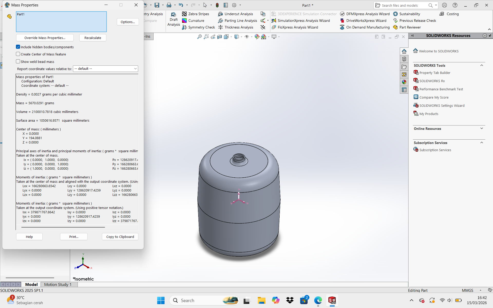
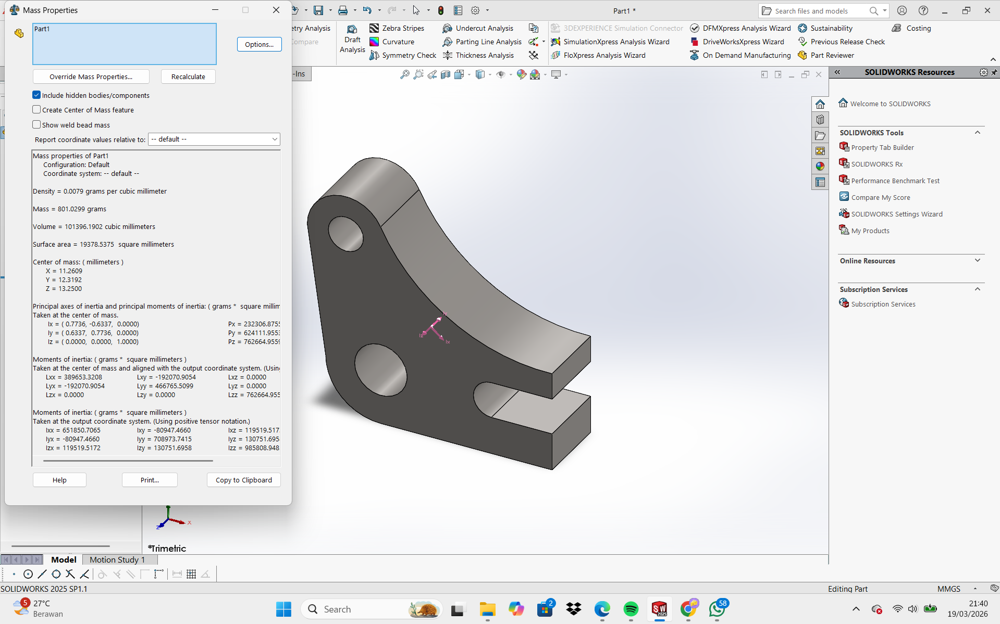

# Modul 4 Praktikum CAD-CAM

## Identitas Mahasiswa
- **Nama:** Delphinta Belladonna  
- **NIM:** 40040325620007 
- **Program Studi:** S.Tr. Teknologi Rekayasa Otomasi  
- **Departemen:** Teknologi Industri  
- Sekolah Vokasi  
- Universitas Diponegoro  

---

## Dosen Pengampu
- **Megarini Hersaputri, S.T., M.T.**  
- **Rofiq Cahyo Prayogo, S.T., M.T.**  

---

## Lampiran

### 1. Part Plate

### 2. Part Tool Block

### 3. Part Tank

### 4. Part Wheel

### 5. Part Bracket

